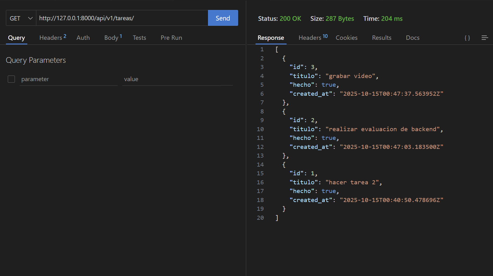
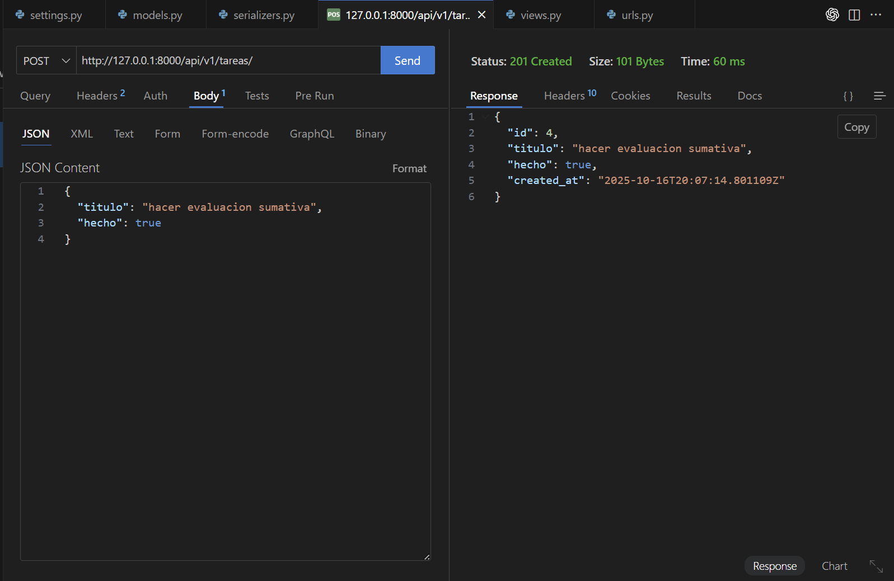
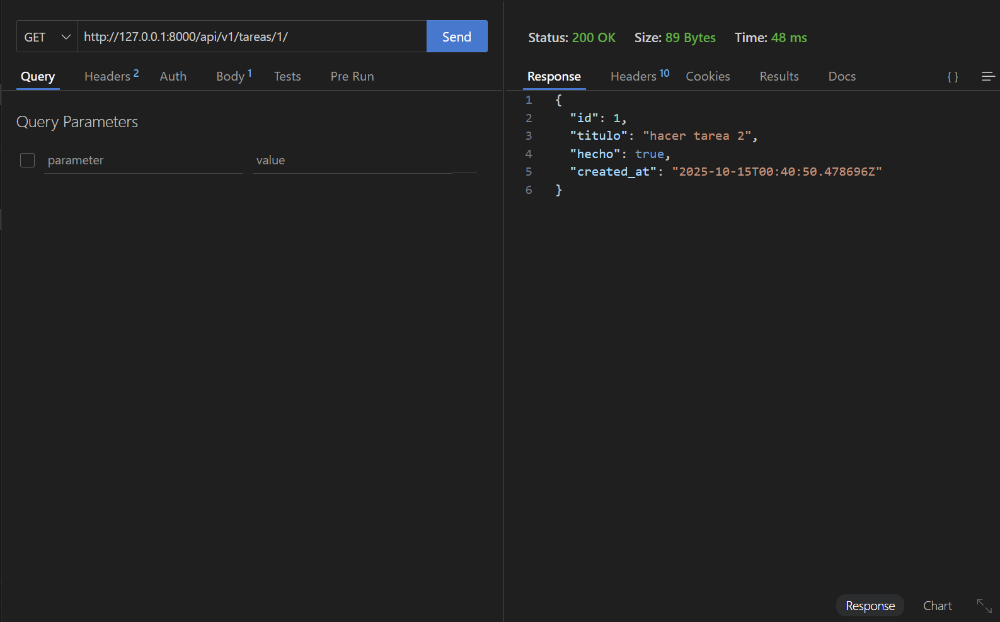
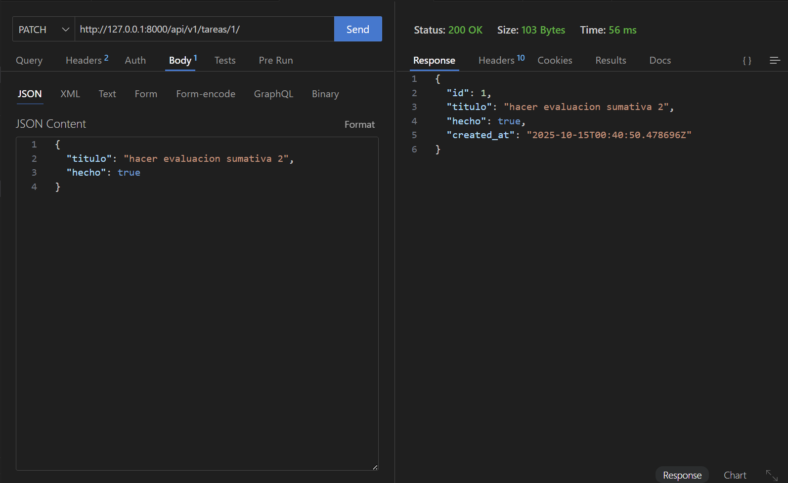
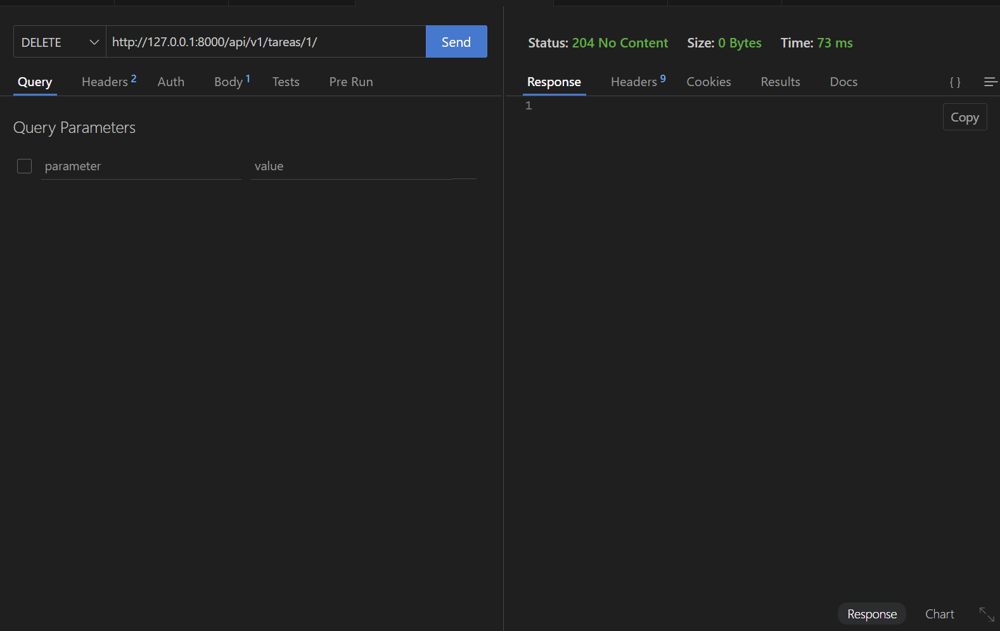
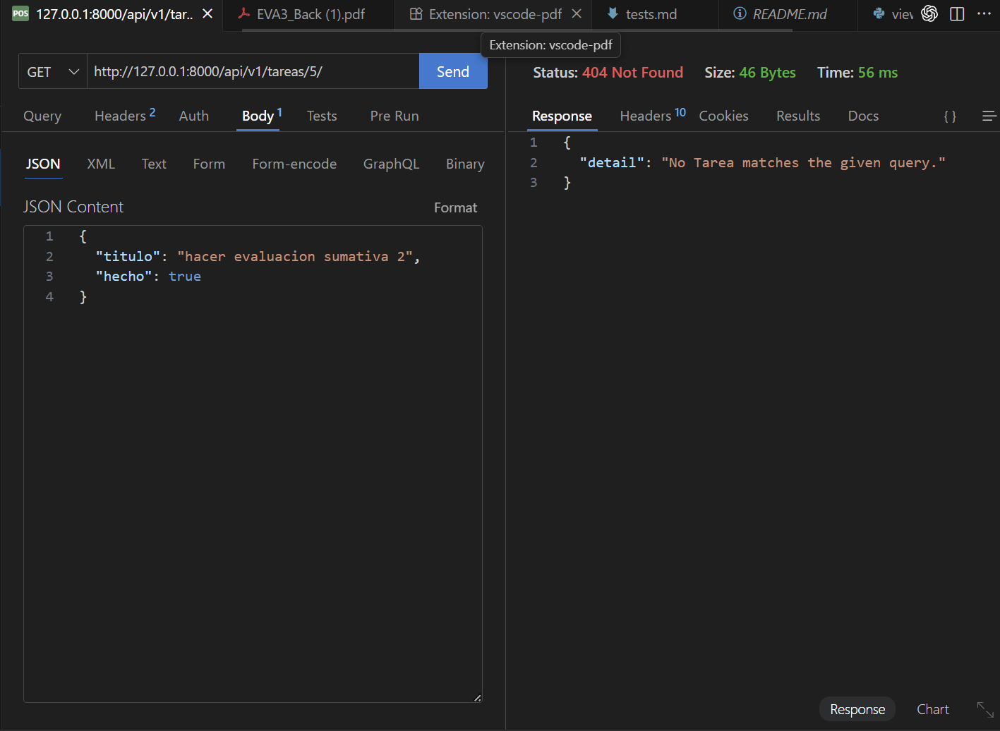
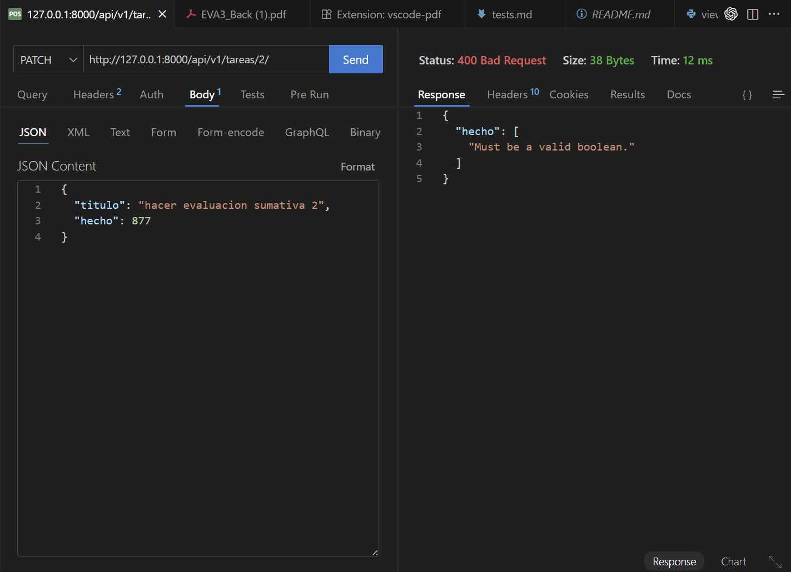

# Evidencias de pruebas

Las pruebas de la API se ejecutaron con Thunder Client (alternativa de postman) sobre un servidor local (`python manage.py runserver`). Cada captura se encuentra en la carpeta `imagenes/` y muestra el estado correcto del endpoint probado.

1. **Listar tareas (`GET /api/v1/tareas/`)**  
   

2. **Crear tarea (`POST /api/v1/tareas/`)**  
   

3. **Detalle de tarea (`GET /api/v1/tareas/{id}/`)**  
   

4. **Actualizar tarea (`PATCH /api/v1/tareas/{id}/`)**  
   

5. **Eliminar tarea (`DELETE /api/v1/tareas/{id}/`)**  
   

### Escenarios de error

1. **404 Not Found (`GET /api/v1/tareas/9999/`)**  
     
   

2. **400 Bad Request (`PATCH /api/v1/tareas/2/`)**  
   
